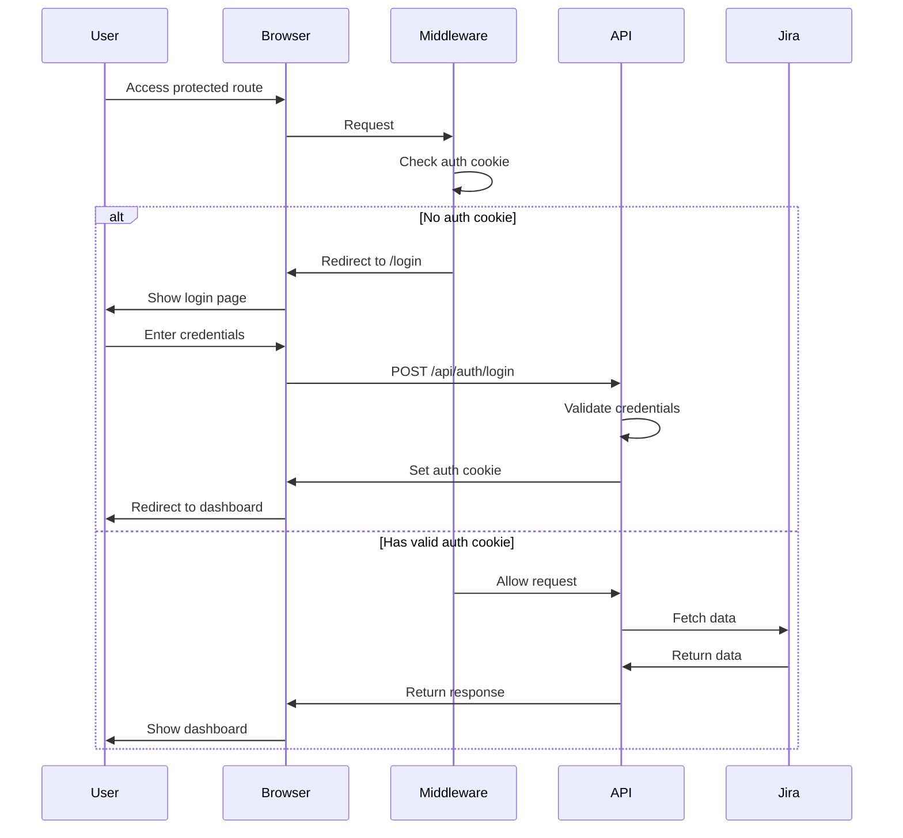

# Authentication System Documentation

Complete guide to the authentication system used in the Jira Automation Dashboard.

## Overview

The application uses a cookie-based authentication system to protect all routes. The authentication flow is simple, secure, and provides a seamless user experience.

## Architecture

### Components

1. **Login Page** (`/login`) - User authentication interface
2. **Middleware** (`src/middleware.ts`) - Route protection
3. **Auth API Routes** - Handle login/logout operations
4. **Auth Cookie** - Stores session state

### Security Features

- httpOnly cookies prevent JavaScript access
- 24-hour session expiration
- Secure cookie flag in production
- Password validation on server side
- Protected API endpoints

## Authentication Flow



## Implementation Details

### Middleware (`src/middleware.ts`)

The middleware intercepts all requests and checks for authentication:

```typescript
export function middleware(request: NextRequest) {
  // Allow access to login page
  if (request.nextUrl.pathname === '/login') {
    return NextResponse.next()
  }

  // Allow auth API routes
  if (request.nextUrl.pathname.startsWith('/api/auth/')) {
    return NextResponse.next()
  }

  // Check for auth cookie
  const auth = request.cookies.get('auth')?.value
  
  if (auth !== 'authenticated') {
    return NextResponse.redirect(new URL('/login', request.url))
  }
  
  return NextResponse.next()
}
```

### Login API Route (`/api/auth/login/route.ts`)

Handles user authentication:

```typescript
export async function POST(request: Request) {
  const { username, password } = await request.json()
  
  // Validate credentials
  const validCredentials = [
    { username: 'admin', password: process.env.ADMIN_PASSWORD || 'admin' },
    { username: 'user', password: process.env.USER_PASSWORD || 'user' }
  ]
  
  const isValid = validCredentials.some(
    cred => cred.username === username && cred.password === password
  )
  
  if (isValid) {
    // Create response with auth cookie
    const response = NextResponse.json({ success: true })
    response.cookies.set('auth', 'authenticated', {
      httpOnly: true,
      secure: process.env.NODE_ENV === 'production',
      sameSite: 'strict',
      maxAge: 60 * 60 * 24, // 24 hours
      path: '/'
    })
    return response
  }
  
  return NextResponse.json({ success: false }, { status: 401 })
}
```

### Logout API Route (`/api/auth/logout/route.ts`)

Clears the authentication session:

```typescript
export async function POST() {
  const response = NextResponse.json({ success: true })
  
  // Clear auth cookie
  response.cookies.set('auth', '', {
    httpOnly: true,
    secure: process.env.NODE_ENV === 'production',
    sameSite: 'strict',
    maxAge: 0,
    path: '/'
  })
  
  return response
}
```

### Login Page Component (`/app/login/page.tsx`)

User interface for authentication:

**Features:**
- Username and password inputs
- Form validation
- Error message display
- Loading states
- Theme toggle support
- Responsive design

**Key Functions:**
- `handleSubmit()` - Validates and submits credentials
- Shows error messages for invalid credentials
- Redirects to dashboard on successful login

## Configuration

### Environment Variables

Configure custom passwords in `.env.local`:

```env
ADMIN_PASSWORD=your-secure-admin-password
USER_PASSWORD=your-secure-user-password
```

If not set, defaults to:
- Admin: username `admin`, password `admin`
- User: username `user`, password `user`

### Cookie Configuration

The auth cookie is configured with:
- **Name**: `auth`
- **Value**: `authenticated`
- **httpOnly**: `true` (prevents JavaScript access)
- **secure**: `true` in production (HTTPS only)
- **sameSite**: `strict` (CSRF protection)
- **maxAge**: 86400 seconds (24 hours)
- **path**: `/` (available site-wide)

## Protected Routes

All routes except the following are protected:
- `/login` - Login page
- `/api/auth/*` - Authentication endpoints
- `/_next/*` - Next.js internal routes
- `/favicon.ico` - Favicon

## Security Best Practices

1. **Never Store Passwords in Code**
   - Use environment variables
   - Use secure password generation
   - Consider integrating with SSO

2. **HTTPS in Production**
   - Ensures cookies are encrypted in transit
   - Prevents man-in-the-middle attacks

3. **Regular Session Expiration**
   - 24-hour sessions limit exposure
   - Forces regular re-authentication

4. **httpOnly Cookies**
   - Prevents XSS attacks from accessing cookies
   - Cookies only sent with HTTP requests

5. **CSRF Protection**
   - sameSite: strict prevents CSRF attacks
   - Consider adding CSRF tokens for enhanced security

## Extending Authentication

### Adding OAuth/SSO

To integrate with OAuth providers:

1. Install OAuth library (e.g., `next-auth`)
2. Configure OAuth provider
3. Update middleware to check OAuth session
4. Add OAuth callback routes

### Adding Role-Based Access

To implement different user roles:

1. Store role in cookie or JWT
2. Check role in middleware
3. Conditionally render UI based on role
4. Protect API endpoints by role

### Adding Multi-Factor Authentication

To add MFA:

1. Generate and store MFA secret
2. Add MFA setup page
3. Verify MFA code on login
4. Store MFA status in session

## Troubleshooting

### Common Issues

1. **"Not authenticated" after login**
   - Check cookie settings in browser
   - Verify environment variables
   - Check for HTTPS in production

2. **Redirect loop**
   - Clear browser cookies
   - Check middleware configuration
   - Verify login route is excluded

3. **Cookie not being set**
   - Check browser console for errors
   - Verify API response includes Set-Cookie header
   - Check for conflicting cookies

### Debug Mode

Enable debug logging by adding to your API routes:

```typescript
console.log('Auth attempt:', { username, timestamp: new Date() })
console.log('Cookie set:', response.cookies.get('auth'))
```

## API Reference

### POST /api/auth/login

**Request Body:**
```json
{
  "username": "string",
  "password": "string"
}
```

**Success Response:**
```json
{
  "success": true,
  "message": "로그인 성공"
}
```

**Error Response:**
```json
{
  "success": false,
  "message": "아이디 또는 비밀번호가 올바르지 않습니다"
}
```

### POST /api/auth/logout

**Success Response:**
```json
{
  "success": true,
  "message": "로그아웃 성공"
}
```

## Testing Authentication

### Manual Testing

1. Access protected route without login
2. Verify redirect to login page
3. Enter valid credentials
4. Verify redirect to original route
5. Verify cookie is set
6. Test logout functionality
7. Verify cookie is cleared

### Automated Testing

Example test cases:

```typescript
describe('Authentication', () => {
  it('redirects to login when not authenticated', async () => {
    const response = await fetch('/api/jira/projects')
    expect(response.redirected).toBe(true)
    expect(response.url).toContain('/login')
  })
  
  it('allows access with valid credentials', async () => {
    const loginResponse = await fetch('/api/auth/login', {
      method: 'POST',
      body: JSON.stringify({ username: 'admin', password: 'admin' })
    })
    expect(loginResponse.ok).toBe(true)
    
    const protectedResponse = await fetch('/api/jira/projects')
    expect(protectedResponse.ok).toBe(true)
  })
})
```