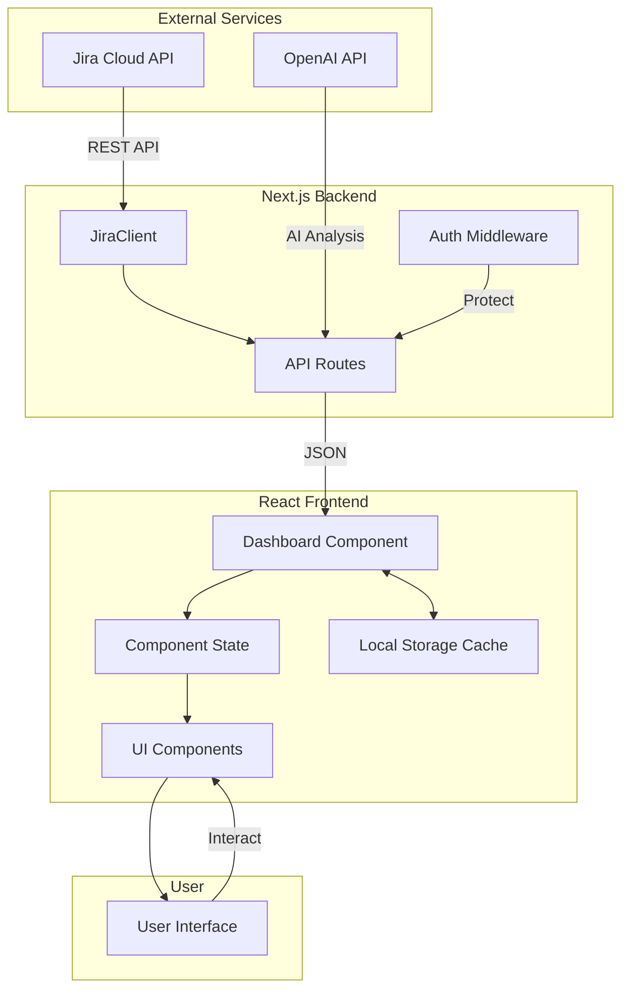
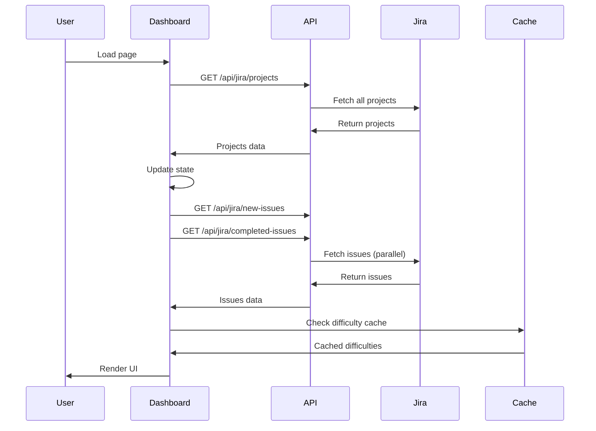
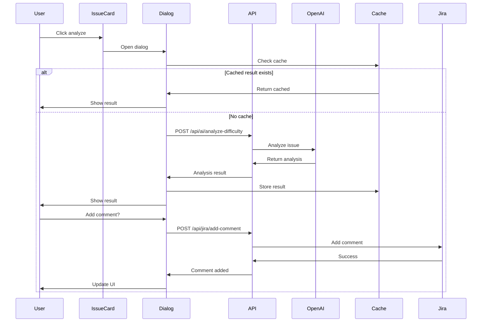

# Data Flow and State Management Documentation

Comprehensive guide to how data flows through the Jira Automation Dashboard application.

## Overview

The application uses a client-side state management approach with React hooks, server-side API routes for Jira integration, and local storage for caching. Data flows from Jira Cloud through Next.js API routes to React components.

## Architecture Diagram



## State Management Strategy

### Component-Level State

The application primarily uses React's built-in state management:

```typescript
// Dashboard component state
const [data, setData] = useState<DashboardData>({
  newIssues: [],
  completedIssues: [],
  projects: [],
  loading: true,
  error: null,
});

const [daysBack, setDaysBack] = useState(7);
const [selectedProject, setSelectedProject] = useState('all');
const [searchQuery, setSearchQuery] = useState('');
```

### Why No Global State Management?

1. **Simplicity**: The app's scope doesn't require complex state management
2. **Performance**: Direct state updates are faster for this use case
3. **Maintainability**: Fewer dependencies and simpler code structure
4. **Data Flow**: Most data flows downward through props

## Data Flow Patterns

### 1. Initial Load Flow



### 2. Filter Change Flow

When user changes project or date filter:

```typescript
// Effect triggers on filter change
useEffect(() => {
  if (data.projects.length > 0) {
    fetchDashboardData();
  }
}, [daysBack, selectedProject, data.projects.length, dateRange]);

// Fetch function updates data
const fetchDashboardData = async () => {
  setData(prev => ({ ...prev, loading: true, error: null }));
  
  // Construct API URLs with filters
  const params = new URLSearchParams();
  if (dateRange.startDate && dateRange.endDate) {
    params.append('startDate', formatDate(dateRange.startDate));
    params.append('endDate', formatDate(dateRange.endDate));
  } else {
    params.append('daysBack', daysBack.toString());
  }
  params.append('projectKey', selectedProject);
  
  // Fetch filtered data
  const [newIssuesData, completedIssuesData] = await Promise.all([
    fetch(`/api/jira/new-issues?${params}`),
    fetch(`/api/jira/completed-issues?${params}`)
  ]);
  
  // Update state with new data
  setData({
    newIssues: newIssuesData.issues,
    completedIssues: completedIssuesData.issues,
    projects: data.projects,
    loading: false,
    error: null
  });
};
```

### 3. Search Flow

Real-time search filtering:

```typescript
// Search state
const [searchQuery, setSearchQuery] = useState('');
const [activeSearchQuery, setActiveSearchQuery] = useState('');

// Debounced search effect
useEffect(() => {
  const timer = setTimeout(() => {
    setActiveSearchQuery(searchQuery);
  }, 300);
  
  return () => clearTimeout(timer);
}, [searchQuery]);

// Filter issues based on search
const filteredNewIssues = useMemo(() => {
  if (!activeSearchQuery) return data.newIssues;
  
  return data.newIssues.filter(issue =>
    issue.fields.summary.toLowerCase().includes(activeSearchQuery.toLowerCase())
  );
}, [data.newIssues, activeSearchQuery]);
```

### 4. AI Analysis Flow



## Caching Strategy

### Local Storage Cache

The application uses a custom caching system for AI analysis results:

```typescript
// DifficultyCache class
export class DifficultyCache {
  private static STORAGE_KEY = 'jira-difficulty-cache';
  private static CACHE_DURATION = 7 * 24 * 60 * 60 * 1000; // 7 days
  
  static get(issueKey: string): IssueDifficulty | null {
    const cache = this.getCache();
    const item = cache[issueKey];
    
    if (!item) return null;
    
    // Check if expired
    const now = new Date().getTime();
    const analyzedAt = new Date(item.analyzedAt || 0).getTime();
    
    if (now - analyzedAt > this.CACHE_DURATION) {
      this.remove(issueKey);
      return null;
    }
    
    return item;
  }
  
  static set(issueKey: string, difficulty: IssueDifficulty): void {
    const cache = this.getCache();
    cache[issueKey] = {
      ...difficulty,
      analyzedAt: new Date()
    };
    localStorage.setItem(this.STORAGE_KEY, JSON.stringify(cache));
  }
}
```

### Cache Benefits

1. **Reduced API Calls**: Prevents redundant OpenAI API calls
2. **Instant Results**: Previously analyzed issues show results immediately
3. **Cost Savings**: Reduces OpenAI API usage costs
4. **Better UX**: Faster response times for users

## API Data Contracts

### Issue Data Structure

```typescript
interface JiraIssue {
  id: string;
  key: string;
  fields: {
    summary: string;
    status: {
      name: string;
      statusCategory: {
        key: string;
        name: string;
      };
    };
    project: {
      key: string;
      name: string;
    };
    created: string;
    updated: string;
    resolutiondate?: string;
    assignee?: {
      displayName: string;
      emailAddress: string;
    };
    // ... more fields
  };
  difficulty?: IssueDifficulty; // Added by frontend
}
```

### API Response Patterns

All API endpoints follow consistent response patterns:

**Success Response:**
```typescript
{
  data: T, // Generic type based on endpoint
  total?: number,
  count?: number
}
```

**Error Response:**
```typescript
{
  error: string,
  details?: string
}
```

## State Update Patterns

### Optimistic Updates

For better UX, some operations use optimistic updates:

```typescript
// Example: Adding difficulty to issue
const handleAnalysisComplete = (difficulty: IssueDifficulty) => {
  // Optimistically update UI
  setIssuesDifficulty(prev => ({
    ...prev,
    [issue.key]: difficulty
  }));
  
  // Cache the result
  DifficultyCache.set(issue.key, difficulty);
};
```

### Error Handling

Consistent error handling across the application:

```typescript
try {
  const response = await fetch(url);
  
  if (!response.ok) {
    throw new Error(`HTTP error! status: ${response.status}`);
  }
  
  const data = await response.json();
  setData(prev => ({ ...prev, ...data, loading: false }));
  
} catch (error) {
  console.error('Error:', error);
  setData(prev => ({
    ...prev,
    loading: false,
    error: error.message || 'An error occurred'
  }));
}
```

## Performance Optimizations

### 1. Parallel Data Fetching

```typescript
// Fetch multiple endpoints simultaneously
const [newIssues, completedIssues] = await Promise.all([
  fetch('/api/jira/new-issues'),
  fetch('/api/jira/completed-issues')
]);
```

### 2. Memoization

```typescript
// Memoize filtered results
const filteredIssues = useMemo(() => {
  return filterIssues(data.issues, searchQuery);
}, [data.issues, searchQuery]);

// Memoize chart data
const chartData = useMemo(() => {
  return processChartData(newIssues, completedIssues);
}, [newIssues, completedIssues]);
```

### 3. Debouncing

```typescript
// Debounce search input
useEffect(() => {
  const timer = setTimeout(() => {
    performSearch(searchQuery);
  }, 300);
  
  return () => clearTimeout(timer);
}, [searchQuery]);
```

## Data Synchronization

### Real-time Considerations

While the app doesn't use real-time updates, it maintains data freshness through:

1. **Manual Refresh**: Users can trigger data refresh
2. **Filter Changes**: Changing filters fetches fresh data
3. **Page Reloads**: Each page load fetches latest data
4. **Cache Expiration**: 7-day cache ensures data isn't too stale

### Conflict Resolution

When cached data conflicts with server data:

1. **Server Priority**: Fresh server data always overwrites cache
2. **Timestamp Checking**: Cache includes timestamps for validation
3. **Graceful Fallback**: If cache fails, fetch from server

## Best Practices

### 1. Data Fetching

- Always show loading states
- Handle errors gracefully
- Use parallel fetching when possible
- Implement proper error boundaries

### 2. State Updates

- Use functional updates for derived state
- Batch related state updates
- Keep state as local as possible
- Lift state only when necessary

### 3. Performance

- Memoize expensive computations
- Debounce user inputs
- Use pagination for large datasets
- Implement virtual scrolling for long lists

### 4. Caching

- Set appropriate cache durations
- Implement cache invalidation
- Handle cache failures gracefully
- Monitor cache size

## Debugging Data Flow

### Development Tools

1. **React Developer Tools**: Inspect component state and props
2. **Network Tab**: Monitor API calls and responses
3. **Console Logging**: Strategic logging for data flow tracking
4. **Local Storage Inspector**: View cached data

### Common Issues

1. **Stale Data**: Check cache expiration and refresh logic
2. **Missing Updates**: Verify effect dependencies
3. **Performance Issues**: Look for unnecessary re-renders
4. **API Errors**: Check network requests and error handling